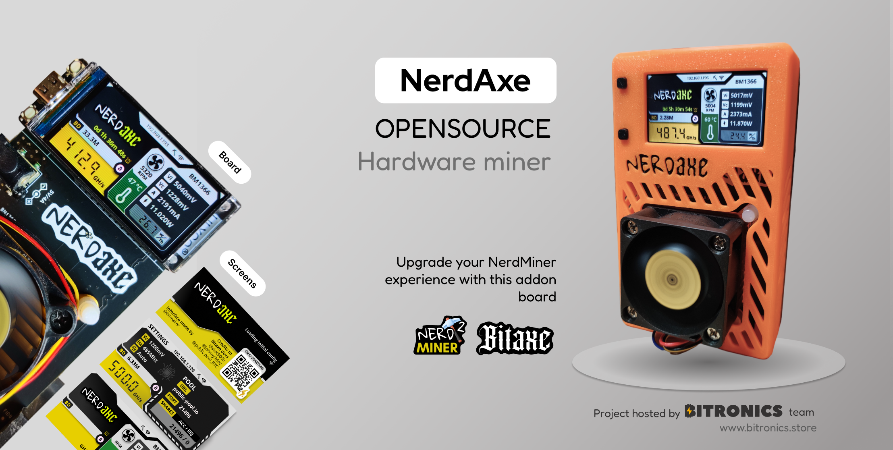

# The Nerdaxe
NerdAxe is a fork from bitaxe with fullcolor display graphics. NerdAxe is indented to be an upgrade board for these who have a NerdMiner and would like to have more powerful mining features without losing the NerdMiner essence. That's why NerdAxe is currently controlled by the common board used on Nerdminer project called TTGO-TDisplayS3.

Currently exists two variants sepparated in two branches:
- **Nerdaxe Gamma**: 1,2Th with a single chip BM1370. [Nerdaxe Gamma](https://github.com/BitMaker-hub/NerdAxe/tree/gamma-1%2C2Ths)
- **Nerdaxe Ultra**: 0,5Th with a single chip BM1366. [Nerdaxe Ultra](https://github.com/BitMaker-hub/NerdAxe/tree/ultra-500Ghs)

The following fork could not be possible without the previous work of @skot, @ben & bitaxe devs. [Check bitaxe project](https://bitaxe.org)

Upgrade your NerdMiner experience throught this addon board and start playing with ASICs

## Goals
- **Plug&Play**: your NerdMiner board and convert it into a NerdAxe.
- **Standalone**: can mine directly to your pool over WiFi. No External computer needed.
- **Embedded**: low cost, low maintenance, high availability, high reliability, low power.
- **ASIC**: working with most efficient ASIC chips from Bitmain - BM1370.
- **Versatile**: solo/pool mining, autotune power/heat/efficiency.
- **Open Source**: All design files are provided.

## Features
- **TTGO-TDisplay** ESP32s3 wifi microcontroller display board
- **Multiple Screens** to allow you see all the miner stats 
- **TI TPS546D** buck regulator steps down the 5V input to power the BM1370
- **Microchip EMC2101** PWM controls the fan and monitors tach output. Measuring internal die temp isn't working.

## Software & Firmware
Nerdaxe firmware was forked from original ESP-Miner version and adapted to use TTGO board and LVGL as graphic interface lib. 
Check it here -> [ESP-Miner Nerdaxe version](https://github.com/BitMaker-hub/ESP-Miner-NerdAxe)

**Today** Nerdaxe is using the latest evolution of this firmware modified by @pmaxuw (creator of the NerdQaxe) and used for other multiple boards
Current firmware -> [ESP-Miner Nerdaxe version](https://github.com/BitMaker-hub/ESP-Miner-NerdAxe)

Flash the latest Nerdaxe firmware here: 
- Go to flasher online tool: https://flasher.bitronics.store/ (recommend via Google Chrome incognito mode)
- Nerd\*axe flasher online tool: https://shufps.github.io/nerdqaxe-web-flasher/  

## The DIY area

### Asic BM1370
- The BM1370 is a undocumented SHA256 mining ASIC from Bitmain. It's mostly used in the Antminer S21pro/S21+
- Bitmain claims the BM1370 has 0.021J/GH efficiency
- The BM1370 is available (new) for around $60 each in small quantities.
- The BM1370 has a different footprint and pinout from the MB1366, BM1368 in previous bitaxe.

### Other components & build troubleshooting
- BM1370 from NBTC on AliExpress
- [40x40mm heatsink and 5V fan](https://www.aliexpress.com/item/2251832861666365.html) from a random AliExpress seller. At least half of these arrived broken in some way. But they are cheap and the working ones do keep the BM1387's nice and cool when used with some thermal compound.
    - Swap this fan with the [Noctua NF-A4x10](https://noctua.at/en/products/fan/nf-a4x10-pwm) 5V 4-Pin fan for a much more pleasant experience.
- Board is designed with [KiCad 8](https://www.kicad.org) design files
- All of the parts on the board are listed in the KiCad BOM
- Check out [building.md](building.md) for PCB ordering tips
- Check out [assembly.md](assembly.md) for assembly tips

### Power Supply Requirements
- 5VDC Power supply 5A minimum. Should be capable of over 25W

